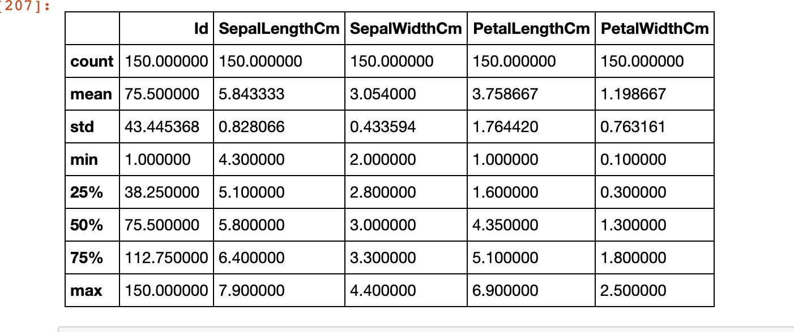
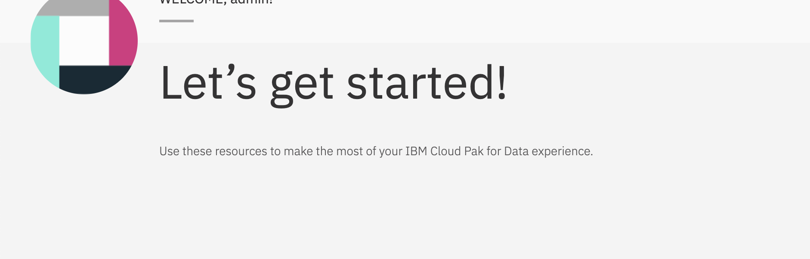
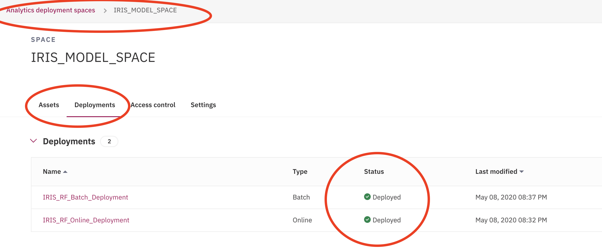
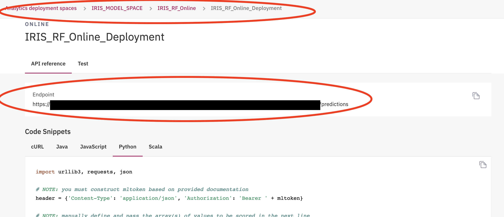
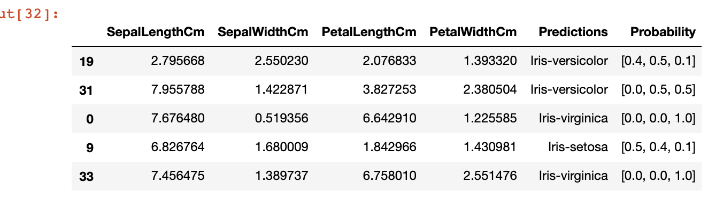
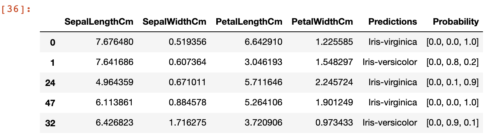
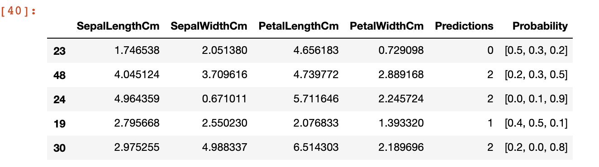
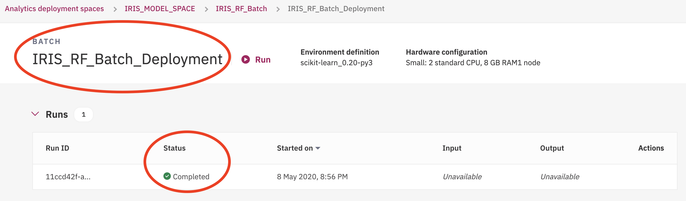

# Online and Batch Deployment/Scoring in CP4D 2.5 with WML Python Client
<br>

* The purpose of this guide is to demo how to <b>DEPLOY</b> and <b>SCORE</b> your ML Model using the WML Python Client.
* An <b>XGBOOST</b> model trained on the <b>Kaggle Iris Dataseta</b> is deployed, and scored via <b>Batch and Online</b> methods.
* Whether you are on a Watson Studio, Jupyter, or local DE, simply import the Watson ML Client library and bring your models to life!

**Please Note:** 
* There are several ways to deploy models on Watson ML. This guide demos 'Python Client' method. Other methods are in the watson-machine-learning-client documentation.
* The CP4D instance used is deployed in a specific [CSPLAB environment for CPAT USE.](https://zen-cpd-zen.apps.lb.development01.csplab.local/zen) Access may need to be requested. 
* The corresponding notebook for this guide can be found [HERE](https://github.ibm.com/Emilio-Fiallos/Community-Guides/blob/master/IRIS_MODEL_DEPLOYMENT.ipynb)
  

## Sources
* [CP4D 2.5 INSTANCE](https://zen-cpd-zen.apps.lb.development01.csplab.local/zen) The CP4D used in this guide is deployed in a **CSPLAB** environment. Access may need to be requested. 
* <a href="https://www.kaggle.com/uciml/iris#Iris.csv">KAGGLE IRIS DATA</a>  Includes three iris species with 50 samples each as well as some properties about each flower.
* <a href="https://dataplatform.cloud.ibm.com/docs/content/wsj/analyze-data/ml-authentication.html">WML Auth INFO</a> The 'Authentication' overview section of the Watson Machine Learning info on IBM CLOUD Website.
* <a href="https://dataplatform.cloud.ibm.com/docs/content/wsj/analyze-data/ml-deploy_new.html?audience=wdp">WML Deployment GEN INFO</a>  The 'Deployment' overview section of the Watson Machine Learning info on IBM CLOUD Website.
* <a href="https://wml-api-pyclient.mybluemix.net/">WML Deployment DOCS</a>  the watson-machine-learning-client documentation.
* <a href="https://wml-api-pyclient-dev-v4.mybluemix.net/">WML Deployment V4 DOCS</a>  the watson-machine-learning-client_v4 documentation. More detailed and developer orientated documentation.


## Notebook Layout
- **Section 1:** [Packages and EDA](#Section1-Packages-and-EDA)
- **Section 2:** [Model Training and Building](#Section2-Model-Training-and-Building)
- **Section 3:** [WML Client Instantiation](#Section3-WML-Client-Instantiation)
  - **3a:** Generate IBM Identity Access Management (IAM) Token for IBM Cloud Private (ICP)
  - **3b:** Authenticate and Create WML Python Client Object 
- **Section 4:** [Deployments](#Section4-Deployments) 
  - **4a:** Create and/or set Deployment Space
  - **4b:** Online Deployment
  - **4c:** Batch Deployment
- **Section 5:** [Scoring](#Section5-Scoring)
  - **5a:** Online Scoring - Using REST API Endpoint 
  - **5b:** Online Scoring - Using WML Python Client
  - **5c:** Batch Scoring


## Section1 Packages and EDA

Here are some quick summary statistics of the Iris Dataset:

* <b>Columns</b>: Id, SepalLengthCm, SepalWidthCm, PetalLengthCm, PetalWidthCm, Species
* <b>Observations</b>: 150
* <b>Classes</b>: Iris-virginica (50), Iris-versicolor (50), Iris-setosa (50)


```python
import pandas as pd 
import numpy as np 

#Modeling Packages
!pip install sklearn_pandas
import sklearn 
from sklearn.model_selection import train_test_split
from sklearn.preprocessing import LabelEncoder
from sklearn.ensemble import RandomForestClassifier

#Packges for IAM Access Token 
import json
import requests
import base64
from requests.auth import HTTPBasicAuth
import time
import warnings

#Packages for WML Client
from watson_machine_learning_client import WatsonMachineLearningAPIClient
import os
```


```python
df = pd.read_csv('/project_data/data_asset/Iris.csv')
df.describe() 
```

<p align="center">
  
</p>


```python
df.Species.value_counts()
```
    Iris-virginica     50
    Iris-versicolor    50
    Iris-setosa        50
    Name: Species, dtype: int64


## Section2 Model Training and Building

* <b>Data Transformations:</b> The dependent variable, Species, is transformed with <b>LabelEncoder</b>. Classes are 0,1,2 for Iris-virginica, Iris-versicolor, and Iris-setosa respectively. 
* <b>Estimator:</b> <b>XGBOOST</b> classifier. There is no parameter tuning. 
* <b>Results:</b> 93% global accuracy.

<b> *** Please Note: </b> This notebook focuses on deployments, not model building/tuning. 

```python
spec_encode = LabelEncoder().fit(df.Species)
df['Species'] = spec_encode.transform(df.Species)
```


```python
X = df.drop(['Id','Species'], axis = 1)
y = df.Species
X_train, X_test, y_train, y_test = train_test_split(X, y, test_size=0.2, random_state=42, stratify=y)
```


```python
random_forest = RandomForestClassifier()
model= random_forest.fit( X_train, y_train )
```

    /opt/conda/envs/Python-3.6/lib/python3.6/site-packages/sklearn/ensemble/forest.py:246: FutureWarning: The default value of n_estimators will change from 10 in version 0.20 to 100 in 0.22.
      "10 in version 0.20 to 100 in 0.22.", FutureWarning)


```python
# call model.predict() on your X_test data to make a set of test predictions
y_prediction = model.predict( X_test )
# test your predictions using sklearn.classification_report()
report = sklearn.metrics.classification_report( y_test, y_prediction )
# and print the report
print(report)
```

                  precision    recall  f1-score   support
    
               0       1.00      1.00      1.00        10
               1       0.90      0.90      0.90        10
               2       0.90      0.90      0.90        10
    
       micro avg       0.93      0.93      0.93        30
       macro avg       0.93      0.93      0.93        30
    weighted avg       0.93      0.93      0.93        30
    


## Section3 WML Client Instantiation


### 3a: Generate IBM Identity Access Management (IAM) Token for IBM Cloud Private (ICP)

&emsp; If you are in the CP4D instance, calling **os.environ['RUNTIME_ENV_APSX_URL']** will return the url <br>
&emsp; If you are not in a CP4D instance, the URL can be found on the **'Lets Get Stared'** page <br>
&emsp; **OR** If you are not in a CP4D instance, the URL is also the ip, port pair combo. **Ex: https://< xyz-web-or-ip >:< port number >**


* You need an IAM token to instantiate a Python Client Object
* <b>Inputs:</b> Username, password, and url (or IP, port pair) of your CP4D cluster <br>
&emsp; If you are in the CP4D instance, calling **os.environ['RUNTIME_ENV_APSX_URL']** will return the url <br>
&emsp; If you are not in a CP4D instance, the URL can be found on the **'Lets Get Stared'** page <br>
&emsp; **OR** If you are not in a CP4D instance, the URL is also the ip, port pair combo. **Ex: https://< xyz-web-or-ip >:< port number >** <br> 
<b> *** Please Note: </b> This generated an IAM token for <b> ICP. </b> The process is nuanced for IBM Public Cloud. You would need an API Key. Refer to documentation for more info. 
<br>

<p align="center">
  
</p>

```python
CREDENTIALS = {
                      "username": 'xyz',
                      "password": "abc",
                      # address should be replaced with ip, port pair to be used in scripts outside ICP
                      "url": 'https://<ip>:<port-number>'
                   }


def generate_access_token():
    headers={}
    headers["Accept"] = "application/json"
    auth = HTTPBasicAuth(CREDENTIALS["username"], CREDENTIALS["password"])
    
    ICP_TOKEN_URL= CREDENTIALS["url"] + "/v1/preauth/validateAuth"
    
    response = requests.get(ICP_TOKEN_URL, headers=headers, auth=auth, verify=False)
    json_data = response.json()
    icp_access_token = json_data['accessToken']
    return icp_access_token

token = generate_access_token()
```

### 3b: Authenticate and Create WML Python Client Object 

* Once you have your IAM token, you can create a WML Python Client Object. <br>

**INPUTS** <br> 
**Token:** IAM token obtained in step 3A  <br> 
**Instance Id:** Set to 'ICP' or 'Openshift' depending on what platform Watson Studio is running on.  <br> 
**Url:** IP, port pair of where Watson Studio is located. <br> 
&emsp; This can be found calling **os.environ['RUNTIME_ENV_APSX_URL']** if you are in ICP. <br> 
&emsp; You can also use the URL of the Watson Studio instance if you are in ICP (this was done in 3a). <br> 
**Version:** In our case, it is '2.5.0'. <br>
&emsp; **IBM CP4D 3.0 is days away from being released.** In that case, version would be set to '3.0.0'. <br> 

<b> *** Please Note: </b> This generates a client object for <b>ICP.</b> The process is nuanced for IBM Public Cloud. You would need an API Key and WML Instance ID. Refer to documentation for more info. 


```python
#token = os.environ['USER_ACCESS_TOKEN']
url= os.environ['RUNTIME_ENV_APSX_URL']

wml_credentials = {
   "token": token,
   "instance_id" : "openshift",
   "url": url,
   "version": "2.5.0"
}

wml_client = WatsonMachineLearningAPIClient(wml_credentials)
```

## Section4 Deployments

### 4a: Create and/or Set Deployment Space

* Setting a default Deployment Space or Project ID is <b>the first and mandatory step </b> in CP4D. This tells the client from where to push/pull information. 
* Because the focus is Deployments, a Deployment Space ID will be set. 


```python
SPACE_NAME = "IRIS_MODEL_SPACE"
```

```python
# If Space with same name, set new ID, if not, create new ID for project 
space_name = SPACE_NAME
spaces = wml_client.spaces.get_details()['resources']
space_id = None
for space in spaces:
    if space['entity']['name'] == space_name:
        space_id = space["metadata"]["guid"]
if space_id is None:
    space_id = wml_client.spaces.store(
        meta_props={wml_client.spaces.ConfigurationMetaNames.NAME: space_name})["metadata"]["guid"]
wml_client.set.default_space(space_id)
```


    'SUCCESS'

* Navigate to the **'sandwich'** icon at the top left of CP4D, go to **analyze**, **analytics deployments**, and you should find your newly created/set deployment space. 


<p align="center">
  
</p>


### 4b: Online Deployment

<b>TRAIN/BUILD</b> MODEL --> <b>STORE MODEL</b> IN DEPLOYMENT SPACE (CREATE ID) --> <b>DEPLOY MODEL</b> FROM DEPLOYMENT SPACE (CREATE ID) 
* Online and Batch deployment cycles are identical. A trained model is stored (in the deployment space) and subsequently deployed.<br>

**Steps For Online Deployments:** <br> 
**1.** Model and deployment names are set <br>
**2.** Deployment space checked for any existing deployments set to what was named in Step1. If so, deployment and associated model are deleted. New ones are set. <br> 
**3.** Model is pushed and stored in deployment space. Model ID created. <br> 
**4.** Model is deployed from deployment space. Deployment ID created. <br>  


```python
MODEL_NAME = 'IRIS_RF_Online'
deployment_name = 'IRIS_RF_Online_Deployment'
```


```python
# Remove any deployments and associated models with same name
deployment_details = wml_client.deployments.get_details()
for deployment in deployment_details['resources']:
    deployment_id = deployment['metadata']['guid']
    model_id = deployment['entity']['asset']['href'].split('/')[3].split('?')[0]
    if deployment['entity']['name'] == deployment_name:
        print('Deleting deployment id', deployment_id)
        wml_client.deployments.delete(deployment_id)
        print('Deleting model id', model_id)
        wml_client.repository.delete(model_id)
```

    Deleting deployment id feb19551-9490-4d5d-b081-1d3932be67ba
    Deleting model id b3c14aec-aed8-477f-be53-9961a9af8ce4


```python
#Save Model to Space 

space_metadata = {
    wml_client.repository.ModelMetaNames.NAME: MODEL_NAME,
    wml_client.repository.ModelMetaNames.TYPE: "scikit-learn_0.20",
    wml_client.repository.ModelMetaNames.RUNTIME_UID: "scikit-learn_0.20-py3",
    wml_client.repository.ModelMetaNames.TAGS: [{'value' : 'iris_online_tag'}],
    wml_client.repository.ModelMetaNames.SPACE_UID: space_id
}

stored_model_details = wml_client.repository.store_model(model=model, meta_props=space_metadata)
```


```python
# Deploy the model

meta_props = {
    wml_client.deployments.ConfigurationMetaNames.NAME: deployment_name,
    wml_client.deployments.ConfigurationMetaNames.TAGS : [{'value' : 'iris_online_deployment_tag'}],
    wml_client.deployments.ConfigurationMetaNames.ONLINE: {}
}

model_uid = stored_model_details["metadata"]["guid"]
wml_client.deployments.create(artifact_uid=model_uid, meta_props=meta_props)
```

    
    
    #######################################################################################
    
    Synchronous deployment creation for uid: 'b6414ed4-2140-4014-8e18-5540859c9d52' started
    
    #######################################################################################
    
    
    initializing
    ready
    
    
    ------------------------------------------------------------------------------------------------
    Successfully finished deployment creation, deployment_uid='05e353f1-63c5-4020-8205-c7f749ddd379'
    ------------------------------------------------------------------------------------------------
    

    {'metadata': Excluded for Privacy Reasons } 


### 4c: Batch Deployment

* Online and Batch deployment cycles are identical. A trained model is stored (in the deployment space) and subsequently deployed. <br> 

**Steps for Batch Deployments:** <br> 
**1.** Model and deployment names are set <br>
**2.** Deployment space checked for any existing deployments set to what was named in Step1. If so, deployment and associated model are deleted. New ones are set. <br> 
**3.** Model is pushed and stored in deployment space. Model ID created. <br> 
**4.** Model is deployed from deployment space. Deployment ID created. <br>  

```python
MODEL_NAME = 'IRIS_RF_Batch'
deployment_name = 'IRIS_RF_Batch_Deployment'
```

```python
# Remove any deployments and associated models with same name

deployment_details = wml_client.deployments.get_details()
for deployment in deployment_details['resources']:
    deployment_id = deployment['metadata']['guid']
    model_id = deployment['entity']['asset']['href'].split('/')[3].split('?')[0]
    if deployment['entity']['name'] == deployment_name:
        print('Deleting deployment id', deployment_id)
        wml_client.deployments.delete(deployment_id)
        print('Deleting model id', model_id)
        wml_client.repository.delete(model_id)
```

    Deleting deployment id 8ba6a8c7-3283-4574-9c34-85e9b77b8860
    Deleting model id ad86a200-4a84-4e83-875e-c8a246704bc9


```python
# Save model to Space

space_metadata = {
    wml_client.repository.ModelMetaNames.NAME: MODEL_NAME,
    wml_client.repository.ModelMetaNames.TYPE: "scikit-learn_0.20",
    wml_client.repository.ModelMetaNames.RUNTIME_UID: "scikit-learn_0.20-py3",
    wml_client.repository.ModelMetaNames.TAGS: [{'value' : 'iris_batch_tag'}],
    wml_client.repository.ModelMetaNames.SPACE_UID: space_id
}

stored_model_details = wml_client.repository.store_model(model=model, meta_props=space_metadata)
```


```python
# Deploy the model

meta_props = {
    wml_client.deployments.ConfigurationMetaNames.NAME: deployment_name,
    wml_client.deployments.ConfigurationMetaNames.TAGS : [{'value' : 'iris_batch_deployment_tag'}],
    wml_client.deployments.ConfigurationMetaNames.BATCH: {},
    wml_client.deployments.ConfigurationMetaNames.COMPUTE: {
        "name": "S",
         "nodes": 1
     }
 }

model_uid = stored_model_details["metadata"]["guid"]
wml_client.deployments.create(artifact_uid=model_uid, meta_props=meta_props)
```

    
    
    #######################################################################################
    
    Synchronous deployment creation for uid: '1a9dd98f-f9d2-41a8-95d2-8a9a8a88269a' started
    
    #######################################################################################
    
    
    ready.
    
    
    ------------------------------------------------------------------------------------------------
    Successfully finished deployment creation, deployment_uid='76bc05cd-f236-498e-b94e-61ab296d6b6b'
    ------------------------------------------------------------------------------------------------
    
    {'metadata': Excluded for Privacy Reasons } 


* In the deployment space, you will be able to see the 'saved' and 'deployed' models in the **'Assets'** and **'Deployments'** tabs respectively.  


<p align="center">
  
</p>


## Section5 Scoring

### 5a: Online Scoring - Using REST API Endpoint

* An Online Deployment can be accessed through the <b>Python Client</b>, <b>Command Line Interface (CLI)</b>, or <b>REST API.</b>

**Steps for Online Scoring through REST API** <br> 
**1.** Define online deployment name and retrieve ID (your online model should have already been deployed). <br>
**2.** Retrieve the Online URL by either constructing the URL or calling **wml_client.deployments.get_details(< model id >).** <br>
&emsp; The Endpoint/URL construction in our case is <b>'< url where model is deployed >/4/deployment< model id >/predictions'</b> <br>
&emsp; The scoring Endpoint/URL can also be found by **clicking** on the online deployment <br>


<p align="center">
  
</p>

**3.** Construct authentication header (using IAM Token), scoring payload, and score results <br> 
&emsp; Boiler Code is used for the authentication header, payload constructer, and scoring. This can be found in the documentation. <br> 
&emsp; <b> *** </b> ML Token is the IAM token defined in <b>Section 3</b><br> 
&emsp; <b> *** </b> WML is a stickler for the payload input. Valid payloads for scoring are list of <b>values, pandas or numpy dataframes.</b> <br>
&emsp;<b> *** </b> Online score by running <b>requests.post(< scoring url > , < scoring payload > , verify = False )</b> <br>
**4.** Compile output. Compiling output is at user discretion. <br>  
  
```python
#1. Setting and finding deployment name 
online_deployment_name = 'IRIS_RF_Online_Deployment'
online_deployment_id = None

for dep in wml_client.deployments.get_details()['resources']:
    if dep['entity']['name'] == online_deployment_name:
        print('found id!')
        online_deployment_id = dep['metadata']['guid']    ### HERE WE ARE FINDING CORRESPONDING DEPLOYMENT ID 
        break
if online_deployment_id == None: print('did not find id')
```

    found id!


```python
# Creating dummy score data
sep_length = (8 - .8) * np.random.random_sample((50,)) + .8
sep_width = (5 - .4) * np.random.random_sample((50,)) + .4
pet_length = (7 - 1.7) * np.random.random_sample((50,)) + 1.7
pet_width  = (3 - .7) * np.random.random_sample((50,)) + .7

score_data = pd.DataFrame({'SepalLengthCm':sep_length,'SepalWidthCm':sep_width,'PetalLengthCm':pet_length,'PetalWidthCm':pet_width})
```


```python
#2. Constructing scoring URL 
def get_online_deployment_href(asset_id, url):
    DATA_ASSET = u'{}/v4/deployments/{}/predictions'
    return DATA_ASSET.format(url,asset_id)

iris_online_href = get_online_deployment_href(online_deployment_id,CREDENTIALS['url'])
```


```python
#3. Construct authentication header, scoring payload, and score results 
mltoken = token
header = {'Content-Type': 'application/json', 'Authorization': 'Bearer ' + mltoken}
payload_scoring = {"input_data": [{"fields": score_data.columns.tolist(), "values": score_data.values.tolist()}]}
response_scoring = requests.post(iris_online_href , json=payload_scoring, headers= header,verify = False)
online_scoring_results = json.loads(response_scoring.text)
```


```python
#4. Compile Results
score_result_columns = online_scoring_results['predictions'][0]['fields']
score_result_data =online_scoring_results['predictions'][0]['values']

online_result_df = score_data.copy()
online_result_df['Predictions'] ,online_result_df['Probability'] = [x[0] for x in score_result_data ], [x[1] for x in score_result_data ]
online_result_df['Predictions'] = spec_encode.inverse_transform(online_result_df['Predictions'])
```


```python
online_result_df.sample(5)
```

<p align="center">
  
</p>


### 5b: Online Scoring - Using WML Python Client

* An Online Deployment can be accessed through the <b>Python Client</b>, <b>Command Line Interface (CLI)</b>, or <b>REST API.</b>

**Steps for Online Scoring through PYTHON CLIENT** <br> 
**1.** Define online deployment name and retrieve ID (your online model should have already been deployed). <br>
**2.** Construct the scoring payload, and score results <br> 
&emsp; Boiler Code is used for the scoring. This can be found in the documentation. <br> 
&emsp; <b> *** </b> WML is a stickler for the payload input. Valid payloads for scoring are list of <b>values, pandas or numpy dataframes.</b> <br>
&emsp;<b> *** </b> Online score by running <b> wml_client.deployments.score(< deployment id > , < scoring payload >)</b> <br>
**4.** Compile output. Compiling output is at user discretion. <br> 


```python
online_deployment_name = 'IRIS_RF_Online_Deployment'
online_deployment_id = None

for dep in wml_client.deployments.get_details()['resources']:
    if dep['entity']['name'] == online_deployment_name:
        print('found id!')
        online_deployment_id = dep['metadata']['guid']    ### HERE WE ARE FINDING CORRESPONDING DEPLOYMENT ID 
        break
if online_deployment_id == None: print('did not find id')

```

    found id!


```python
scoring_payload = {wml_client.deployments.ScoringMetaNames.INPUT_DATA: [{'fields': score_data.columns.tolist(), 'values': score_data.values.tolist()  }]}

```


```python
online_scoring_results = wml_client.deployments.score(online_deployment_id, scoring_payload)
```


```python
score_result_columns = online_scoring_results['predictions'][0]['fields']
score_result_data =online_scoring_results['predictions'][0]['values']

online_result_df = score_data.copy()
online_result_df['Predictions'] ,online_result_df['Probability'] = [x[0] for x in score_result_data ], [x[1] for x in score_result_data ]
online_result_df['Predictions'] = spec_encode.inverse_transform(online_result_df['Predictions'])

online_result_df.sample(5)
```

<p align="center">
  
</p>


### 5c: Batch Scoring

* Batch scoring is extremely useful when you are setting up a pipeline that needs to score large amounts of data, at time intervals, or pulls/pushes into databases.<br>
* Supported databses are Cloud Object Storage buckets (COS), DB2, PostgreSQL. 
* In the example, the scoring set is the same as the online datasets. This can be replaced by Database Connection,local csv files, etc. <br> <br>

**Steps for Batch Scoring through PYTHON CLIENT** <br> 
**1.** Define batch deployment name and retrieve ID (your online model should have already been deployed). <br>
**2.** Construct the scoring payload, and score results <br> 
&emsp; Boiler Code is used for the scoring. This can be found in the documentation. <br> 
&emsp; <b> *** </b> WML is a stickler for the payload input. Valid payloads for scoring are list of <b>values, pandas or numpy dataframes.</b> <br>
&emsp;<b> *** </b> Batch score by running <b>client.deployents.create_job(< deployment id > , < scoring payload >)</b> <br>
**4.** Compile output. Compiling output is at user discretion. <br> 

```python
#1. Get the batch Deployment ID - Will be used for creating batch job for scoring 
batch_deployment_name = 'IRIS_RF_Batch_Deployment'
batch_deployment_id = None

for dep in wml_client.deployments.get_details()['resources']:
    if dep['entity']['name'] == batch_deployment_name:
        print('found id!')
        batch_deployment_id = dep['metadata']['guid']    ### HERE WE ARE FINDING CORRESPONDING DEPLOYMENT ID 
        break
if batch_deployment_id == None: print('did not find id') 
```

    found id!


```python
#Create batch scoring job *NOTE*- Jobs can only be created for batch deployments 
batch_scoring_job = wml_client.deployments.create_job(batch_deployment_id, scoring_payload)
batch_scoring_id = batch_scoring_job['metadata']['guid']
```


```python
##Cell will stop running once model job is complete 
state = wml_client.deployments.get_job_status(batch_scoring_id)['state']
while state !='completed':
    state = wml_client.deployments.get_job_status(batch_scoring_id)['state']
print('model scored!')
```

    model scored!


```python
batch_scoring_results = wml_client.deployments.get_job_details(batch_scoring_id)

score_result_columns = batch_scoring_results['entity']['scoring']['predictions'][0]['fields']
score_result_data =batch_scoring_results['entity']['scoring']['predictions'][0]['values']

batch_result_df = score_data.copy()
batch_result_df['Predictions'] ,batch_result_df['Probability'] = [x[0] for x in score_result_data ], [x[1] for x in score_result_data ]

batch_result_df.sample(5)
```

<p align="center">
  
</p>

* You 'run a job' to score in Batch mode. Here is how the output would look like in the GUI 

<p align="center">
  
</p>


## Developed by IBM CPAT team:

Emilio Fiallos - Data Scientist               
